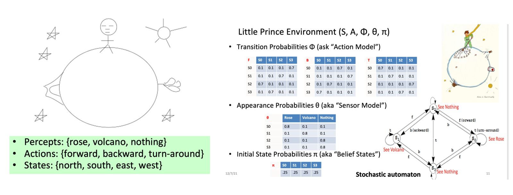
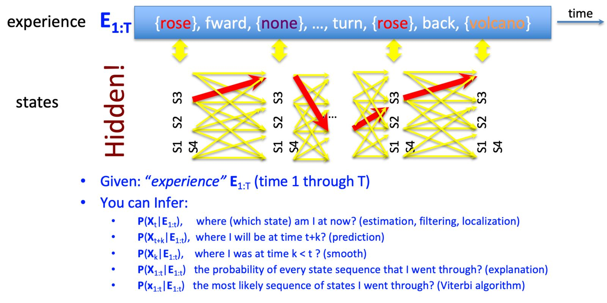
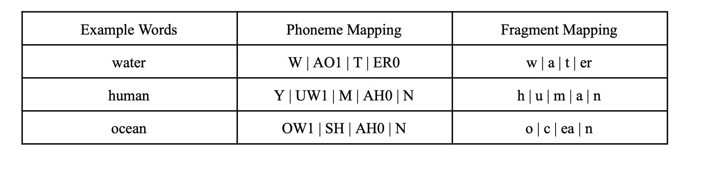

# Temporal Reasoning and Viterbi Algorithm

## Overview

This repository contains the implementation of the Viterbi algorithm applied to temporal reasoning.
The code is part of a programming assignment for the CSCI-561 course - Foundations of Artificial Intelligence.

## Problem Statement

The assignment explores the applications of Temporal Reasoning in Artificial Intelligence. It involves implementing the Viterbi algorithm on two different scenarios: the "Little Prince" environment and a simplified speech recognition environment.

<p align="center"></p>

<p align="center"></p>

<p align="center"></p>

## How to Run the Code

1. **Clone the repository:**

   ```bash
   git clone https://github.com/darshanrao/Viterbi_Algorithm.git


# Input Files
The `data/` directory contains input files for both scenarios:

- `state_weights.txt`: Weight values for every state.
- `state_action_state_weights.txt`: Weight values for (state, action, state) triples.
- `state_observation_weights.txt`: Weight values for every (state, observation) pair.
- `observation_actions.txt`: Sequence of (observation, action) pairs.

# Output
The output will be generated in the `results.txt` file:

- `states.txt`: Predicted state sequence based on the Viterbi algorithm.


For more details about the assignment, refer to the [homework PDF](https://github.com/darshanrao/Viterbi_Algorithm/blob/main/HW3v0_5%20(1).pdf) provided in the repository.
